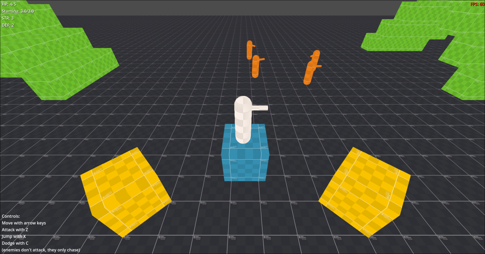

# ARPG Mechanics Demo 2 (incomplete)

A small demo where you can move a character around, jump, dodge and run away from eneies that cannot attack you. You can however attack them. You can also take fall damage :)

Meant to be a small project for learning more about [Godot](https://godotengine.org).

Made with [Godot](https://godotengine.org) 4.4.

## Running

The project can probably be started with this version or later. Once it's been opened, it can just be run normally the same as any other [Godot](https://godotengine.org) project (the default is the F5 key).

## Playing

Game starts as soon as it's opened. There is no sound, so expect silence.

Controls are shown on-screen and the application can be closed by pressing ESCAPE.
